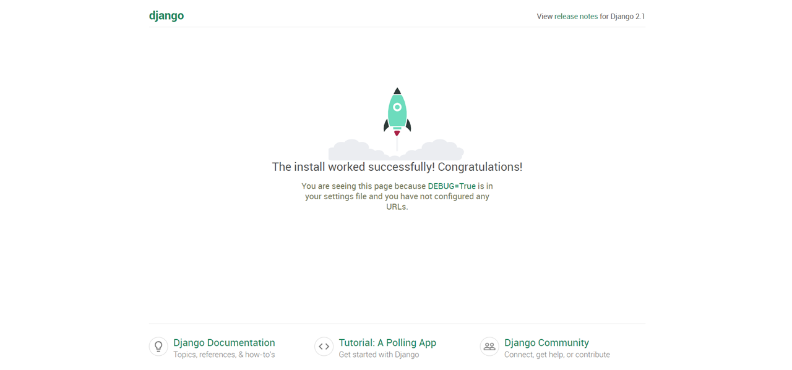

Django Project Start!
===

Contents
---

- [Project 생성](#project-생성)
  - [준비](#준비)
  - [명령어](#명령어)
- [App 생성](#app-생성)
  - [명령어](#명령어)
- [서버 작동](#서버-작동)

Project 생성
---

장고를 이용하여 개발을 진행하기 위해서는 프로젝트를 생성해야만 한다.
> 프로젝트는 장고에서 개발 대상이 되는 프로그램들을 의미한다.

### 준비
프로젝트 생성에 앞서 장고가 설치된 가상환경이 준비되어 있어야 한다. 만약에 준비되어 있지 않다면 해당 [링크](./Install-Django.md)를 참고해서 가상환경을 만들어 주도록 하자.

가상환경이 준비되었다면 아래 명령어로 가상환경을 실행한다.

```bash
$ source "가상환경명"/scripts/activate
$ source "가상환경명"/bin/activate
```
> 윈도우의 경우 첫번째 명령어를, 맥이나 리눅스의 경우 아래 명령어를 사용한다.

```bash
(env) ~/django_workspace/project master $
```

정상적으로 가상환경을 실행했을 시 다음과 같이 쉘 상에 가상환경명이 표기된다.

### 명령어
```bash
$ django-admin startproject "프로젝트명" .
```
프로젝트를 생성하면 필요한 파일이나 디렉터리가 자동적으로 생성된다.

```
workspace(작업 디렉토리)
	├── venv(가상환경)
	├── manage.py
	└── project
		└── settings.py
			urls.py
			wsgi.py
			__init__.py
```

위는 트리 구조로 디렉토리와 파일을 나타낸 것이다.

<details><summary>프로젝트 생성시 점을 붙이는 이유?</summary>

프로젝트를 생성하는 명령어에는 점(.)이 포함되는데, 이것의 의미는 현재 디렉토리(경로)에 프로젝트 관련 파일들을 생성하라는 의미다.

> 명령어에서 점(.)은 현재 경로를 의미한다.

그렇다면 프로젝트를 생성하는 명령어에서 점(.)을 지정해주지 않는다면 어떻게 될까?

```bash
$ django-admin startproject "project"
```

`workspace`라는 디렉토리에서 `venv`라는 가상환경을 생성하여 작업 중이라 가정할때, `project`라는 프로젝트를 점(.) 없이 생성한다면 다음과 같은 일이 벌어질 것이다.

```markdown
workspace(작업 디렉토리)
	├── venv(가상환경)
	└── project*
		├── manage.py
		└── project
			└── settings.py
				urls.py
				wsgi.py
				__init__.py
```

점(.)을 붙이고 생성했을 때와는 달리 `project`라는 이름의 폴더가 하나 더 있다는 것을 알 수 있다. (*로 표기된 것)

이것이 크게 문제가 되는 것은 아니나, 명령어를 내리거나 프로젝트를 관리하는데 있어서 불편함을 야기하므로 되도록 점(.)을 사용하여 프로젝트를 생성하도록 하자.

</details>

App 생성
---

`App`은 프로젝트의 구성단위로 보통 프로젝트 폴더가 생성된 경로에 동일하게 생성된다.

### 명령어

```bash
$ python manage.py startapp "App명"
```

서버 작동
---

정상적으로 장고 프로젝트가 생성되었는지 확인하기 위해서는 서버를 작동시켜야 한다.

```bash
$ python manage.py runserver
```
> MAC OS X와 Linux의 경우 python3 사용

위 명령어를 사용하면, 장고 프로젝트가 로컬에서 실행된다.



> 작동중인 로컬 서버는 로컬주소인 `127.0.0.1:8000`에서 확인할 수 있다.

서버 종료는 `ctrl+c`로 할 수 있다.
