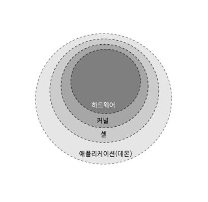

유닉스/리눅스 서버 보안
===

Contents
---

- [유닉스 시스템](#유닉스-시스템)
  - [커널](#커널)
  - [쉘](#쉘)
  - [파일 시스템](#파일-시스템)
- [프로세스](#프로세스)
  - [Run Level](#run-level)
- [시스템 보안](#시스템-보안)
  - [passwd 파일](#passwd-파일)
  - [shadow 파일](#shadow-파일)
  - [접근 권한 마스크(umask)](#접근-권한-마스크umask)
  - [권한 상승/디렉터리 접근권한](#권한-상승디렉터리-접근권한)
- [네트워크 보안](#네트워크-보안)
  - [슈퍼 서버(inetd 데몬)](#슈퍼-서버inetd-데몬)
  - [접근통제 (TCP Wrapper)](#접근통제-tcp-Wrapper)
  - [PAM(Pluggable Authentication Modules, 장착형 인증 모듈)](#pampluggable-authentication-modules-장착형-인증-모듈)
- [서버 취약점 분석, 평가](#서버-취약점-분석-평가)

유닉스 시스템
---

- 대화식 운영체제 : Shell(셸)
- 멀티태스킹, 멀티유저, 호환성/이식성 우수
- 계층적 파일시스템
- 뛰어난 통신기능 및 다양한 유틸리티 제공

### 커널

- 항상 메모리에 상주하면서 하드웨어 자원을 제어
- 프로세스 스케줄링, 기억장치 관리, 파일관리, 시스템 호출, 입출력 서비스 제공
- 가장 하위 수준에서 하드웨어와 직접 관계

### 쉘

- 커널과 사용자 간의 인터페이스
- 기능
  - 명령어 해석 기능
  - 프로그래밍 기능
  - 사용자 환경 설정 기능

### 파일 시스템

계층적 파일시스템으로 구성

- i-node(index node)
  - 파일에 대한 정보를 기억하는 약 120bytes의 고정된 크기의 구조체
  - 구성요소
    - 파일에 대한 정보(파일의 허가권, 소유권, 그룹, 최근 수정된 시간
    - 파일에 할당된 데이터 블록의 주소를 저장하는 필드
- Super Block
  - 파일시스템의 정보를 유지하는 자료구조
  - 파일의 요약 정보와 사용하지 않는 i-node 디스크 블록 위치정보를 가짐

프로세스
---

- PID 0(swapper)
  - 부팅 시간동안 OS에 의해 생성(커널 프로세스)
  - init과 pagedaemon 프로세스를 만들기 위해 fork/exec를 두 번 실행
- PID 1(init)
  - 시스템의 모든 프로세스는 init프로세스의 자손
- PID 2(pagedaemon)
  - swapper와 함께 커널 모드에서 영구적으로 실행(커널 프로세스)
- 고아 프로세스
  - 부모 프로세스가 자식 프로세스보다 먼저 종료된 경우 발생
  - init 프로세스가 고아 프로세스의 부모 프로세스 역할
- 좀비 프로세스
  - 자식 프로세스가 종료되었지만 부모 프로세스가 이를 확인하지 못하는 경우
  - 자식 프로세스는 부모 프로세스가 확인할 때까지 프로세스 테이블에 남음

### Run Level

`/etc/inittab` 파일에 정의된 런레벨에 따라 `/etc/rc[x].d` 디렉터리에 나열된 스크립트가 실행됨

| Run Level | 설명 |
|-----------|-----|
| 0 | PROM 모드 (BIOS 수준에서 작업) / 시스템 종료 (LINUX) |
| S, s | 시스템 단일 사용자 모드, 로컬 파일시스템이 마운트되지 않은 상태 |
| 1 | 시스템 단일 사용자 모드, 로컬 파일시스템이 마운트된 상태 |
| 2 | NFS를 지원하지 않는 다중 사용자 모드 (NFS 클라이언트 모드) |
| 3 | 네트워킹을 지원하는 다중 사용자 모드 (NFS 서버 모드), UNIX 기본 Run Level |
| 4 | 사용자 정의 레벨 |
| 5 | 시스템 종료 / X윈도우 환경 (LINUX) |
| 6 | 시스템 재부팅 |

시스템 보안
---

### passwd 파일

- /etc/passwd
- 사용자와 관련된 정보 저장
- 항목
  - user_account
  - user_password
    - /etc/shadow 파일에 암호화되어 저장되어 있음
  - UID : User ID
    - 보통 100번 이하는 시스템이 사용, 0번은 시스템 관리자를 나타냄
  - GID : Group ID
  - comment
  - home_directory
    - 로그인 성공 후에 사용자가 위치할 홈 디렉터리의 절대경로
  - login_shell: 로그인 셸의 절대경로
    - 로그인이 불필요한 계정의 셸은 `/sbin/nologin`, `/bin/false`으로 지정

### shadow 파일

- /etc/shadow
- 암호화된 패스워드만 저장되도록 하고 관리자만 읽을 수 있도록 제한
- 항목
  - user_id
  - encryption_pw: 일방향 해시 알고리즘을 이용해 암호화한 패스워드
    - 형식: `$id$salt$encrypted_password`
  - last_change: 마지막으로 패스워드를 변경한 날
  - minilife : 최소 패스워드 변경 일수(패스워드를 변경할 수 없는 기간)
  - maxlife : 최대 패스워드 변경 일수(패스워드 변경 없이 사용할 수 있는 일수)
  - warn : 경고 일수(maxlife 필드에 지정한 일수가 얼마 남지 않았음을 알림)
  - inactive : 최대 비활성 일수
  - expires : 계정이 만료되는 날

### 접근 권한 마스크(umask)

- 시스템 관리자는 `/etc/profile`에 umask를 설정하여 전체 사용자에게 동일한 umask 값을 적용
- 개별 사용자에 대한 설정은 `$HOME/.profile`

### 권한 상승/디렉터리 접근권한

- SetUID
  - 실제 사용자가 아닌 해당 파일의 소유자 권한으로 실행
  - `/etc/passwd` 파일에 적용
- SetGID
  - 실제 사용자 계정이 아닌 소유그룹의 권한으로 실행
  - 부서원의 권한을 일괄적으로 적용할 때 사용
- sticky-bit
  - 디렉터리에 특별한 접근권한 부여(공유모드)
  - 설정된 디렉터리는 시스템에 있는 모든 사용자가 파일이나 하위 디렉터리를 생성 가능
  - 삭제는 소유주나 `root`에게만 허용

네트워크 보안
---

### 슈퍼 서버(inetd 데몬)

n개의 개별 서버를 하나로 통합하여 클라이언트로부터 서비스 요청이 올 때마다 해당 서비스와 관련된 실행 모
듈을 실행

- 시스템에서 불필요한 서비스를 제한하기 위해 `/etc/inetd.conf` 파일을 수정
- `inetd` 데몬을 다시 가동해야 반영됨

#### 파일 설정

- 서비스 이름
- 소켓 타입(TCP-stream/UDP-dgram)
- 프로토콜
- 대기설정(TCP-nowait/UDP-wait)
- 로그인 이름
- 서버(실행할 파일의 절대 경로)
- 인자(데몬 실행 시의 명령어)

### 접근통제 (TCP Wrapper)

서비스 요청 과정

1. inetd 데몬
2. tcpd 데몬
3. 접근 권한 검사
4. 해당 데몬에 연결

> inted 데몬이 관리하지 않는 standalone 데몬은 inetd 데몬이 통제할 수 없다.

#### 설정 파일

- 접근 허용 리스트: `/etc/hosts.allow`
- 접근 제한 리스트: `/etc/hosts.deny`
- `/etc/hosts.allow` → `/etc/hosts.deny` 순으로 정책이 적용
- `/usr/sfw/sbin/tcpdchk`을 실행하여 오류 점검

### PAM(Pluggable Authentication Modules, 장착형 인증 모듈)

각 응용 프로그램에 대한 인증, 사용자 권한, 접근 자원을 선택할 수 있는 라이브러리

- 리눅스 배포판에서 사용자 인증의 핵심
- 각 프로그램은 인증이 필요한 부분에 PAM 라이브러리를 호출

#### 설정 파일

- type: 모듈의 종류
  - account: 사용자의 시스템 사용권한 확인
  - auth: 인증기능
  - password: 비밀번호 설정 및 확인
  - session: 인증 성공 시 세션
- control: 모듈 실행 후 PAM 라이브러리 행동 결정
  - requisite: 모듈 실패 시 인증 거부
  - required: 동일 유형 모듈 실행 완료 시점에서 거부
  - sufficient: 인증 시 승인, 실패 시 재인증
  - optional: 모듈의 성공, 실패 응답을 상관하지 않음

서버 취약점 분석, 평가
---

- root 계정 원격 접속 제한
  - 원격 접속 시 root 계정으로 직접 로그인할 수 없도록 설정
- 패스워드 정책 점검
  - 암호입력 횟수 제한
  - 패스워드 길이 제한
  - 사용 기간 점검
  - Brute Force Attack, Password Guessing 공격 방지
- PATH 변수 확인
  - root 계정의 PATH 환경변수에 `.`가 포함되어 있으면 root 계정의 인가
  - 비의도적으로 현재 디렉터리의 명령어가 실행될 수 있음
  - root 계정의 환경변수 설정 파일(/etc/profile)에서 `.`을 마지막에 위치시키거나 삭제
    - `$ echo $PATH #변수 출력`
- 파일 및 디렉터리 소유자 설정
  - 유저를 삭제한 경우 소유자가 없는 파일 발생
  - 파일이나 디렉토리를 검색해서 해결
    - `$ find / -nouser -print`
    - `$ find / -nogroup -print`
