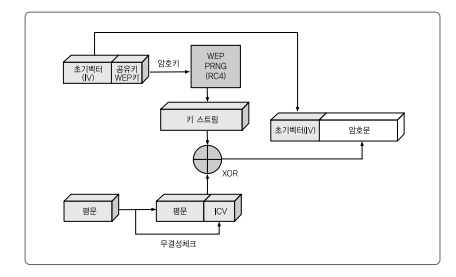
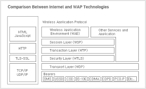

무선통신 보안
===

Contents
---

- [블루투스](#블루투스)
- [무선랜](#무선랜)
  - [취약점](#취약점)
  - [SSID 설정과 폐쇄시스템 운영](#ssid-설정과-폐쇄시스템-운영)
  - [MAC 주소 인증](#mac-주소-인증)
- [무선랜 인증 기술](#무선랜-인증-기술)
  - [WEP(Wired Equivalent Privacy) 인증](#wepwired-equivalent-privacy-인증)
  - [EAP(Extensible Authentication Protocol) 인증](#eapextensible-authentication-protocol-인증)
- [무선랜 암호화 기술](#무선랜-암호화-기술)
  - [WEP(Wired Equivalent Privacy)](#wepwired-equivalent-privacy)
    - [암호화 절차](#암호화-절차)
    - [복호화 절차](#복호화-절차)
  - [TKIP(Temporal Key Integrity Protocol)](#tkiptemporal-key-integrity-protocol)
  - [CCMP(Counter mode with CBC-MAC protocol)](#ccmpcounter-mode-with-cbc-mac-protocol)
- [무선랜 인증 및 암호화 복합 기술](#무선랜-인증-및-암호화-복합-기술)
  - [WPA(Wi-Fi Protected Access)](#wpawi-fi-protected-access)
  - [WPA2(RSN, Robust Security Network)](#wpa2rsn-robust-security-network)
  - [WPA-PSK(Wi-Fi Protected Access Pre-Shared Key)](#wpa-pskwi-fi-protected-access-pre-shared-key)
  - [802.1x/EAP(WPA-EAP, WPA-Enterprise)](#802.1xeapwpa-eap-wpa-enterprise)
- [WAP(Wireless Application Protocol)](#wapwireless-application-protocol)
  - [프로토콜 구조](#프로토콜-구조)
- [인증 기술](#인증-기술)
  - [기기 인증 기술](#기기-인증-기술)
  - [RFID(Radio Frequency Identifier)](#rfidradio-frequency-identifier)
- [모바일 보안](#모바일-보안)
- [BYOD(bring Your Own Device) 보안 기술](#byodbring-your-own-device-보안-기술)

블루투스
---

서로 다른 기능을 가진 장치를 연결하기 위해 설계된 무선 LAN 기술

- 구조
  - 피코넷(piconet)
    - 8개까지의 지국
    - 하나는 주국(Primary)이고, 나머지는 종국(Secondary)
  - 스캐터넷(scatternet)
    - 피코넷이 합쳐진 구조
    - 피코넷 안의 종국은 다른 피코넷에서 주국이 될 수 있음
- 특징
  - 낮은 가격
  - 높은 서비스
  - 케이블 없이 여러 대 동시 연결
- 보안 취약점
  - 블루프린팅(Blueprinting)
    - 블루투스 장치를 검색하는 활동
  - 블루스나핑(Bluesnarfing)
    - 블루투스의 취약점을 이용하여 장치의 임의 파일에 접근하는 공격
  - 블루버깅(Bluebugging)
    - 블루투스 장치 간의 취약한 연결 관리를 악용해 공격 대상 장치를 연결하여 임의의 동작을 수행
  - 블루재킹(Bluejacking)
    - 블루투스를 이용해 특정 정보를 익명으로 퍼뜨리는 것

무선랜
---

### 취약점

- 물리적 취약점
  - 도난 및 파손
  - 구성설정 초기화
  - 전원차단
  - LAN 차단
- 기술적 취약점
  - 도청
  - 서비스 거부(DOS)
  - 불법 AP
    - 사용자 정보 수집
- 관리적 취약점
  - 장비 관리 미흡
  - 사용자의 보안의식 결여
  - 전파 관리 미흡

### SSID 설정과 폐쇄시스템 운영

SSID 값을 NULL로 하여 접속을 요구하는 사용자를 차단하도록 AP를 설정(폐쇄시스템)

- SSID를 모르는 사용자의 접근 시도 감소/차단 효과
- `NetStumbler` 등을 이용한 스푸핑을 미연에 방지

> SSID(Service Set Identifier): 32bytes의 고유 식별자로 구성된 AP를 구분하는 ID

### MAC 주소 인증

접속을 허용하는 사용자의 MAC을 사전에 등록

- 간단한 보안설정으로 효과적인 접근제어
- 대규모 기관에서는 MAC 주소 관리 어려움

무선랜 인증 기술
---

### WEP(Wired Equivalent Privacy) 인증

사용자 인증과 데이터 암호화를 모두 적용 가능

- 구현이 간단하고, 인증 절차도 간결
- 정적 WEP
  - RC4 알고리즘 사용으로 암호화키 복호화에 취약 
  - 단방향 인증의 취약성
    - 불법 복제 AP로 인한 피해 발생 가능성
  - 고정된 공유키 사용의 취약성
    - WEP 키 값이 외부로 유출될 경우 문제 발생
- 동적 WEP
  - 기존 WEP과 다르게 암호화 키 값이 주기적으로 변경
  - 802.1x에서 암호화 기법으로 채택
  - 기존 RC4 알고리즘을 그대로 사용하므로 문제 있음

### EAP(Extensible Authentication Protocol) 인증

IEEE 802.1x에서 사용자 인증 방법으로 사용

- 어떤한 링크에도 접속 가능한 단순한 캡슐화 개념 알고리즘
- 인증 서버와 무선장비 사이에 상호 인증을 허용
- 사용자가 패스워드, OTP, 인증서 등을 사용성을 제공

무선랜 암호화 기술
---

### WEP(Wired Equivalent Privacy)

무선 AP와 무선 단말기 간에 주고받는 무선 전송데이터를 2개의 장비가 약속한 `40bit 공유 비밀키`와 임의로 선택되는 `24bit의 IV` 값을 조합 한 `64bit` 키를 이용해 전송 데이터를 `RC4 스트림 방식`으로 암호화

#### 암호화 절차

- 공유키와 난수 발생기를 이용하여 `RC4 알고리즘`을 통한 키스트림 생성
- 무결성 보장을 위해 `CRC-32 알고리즘`으로 구성되는 ICV(Integrity Check Value)를 사용
- 키스트림과 평문과 ICV값이 합쳐진 데이터를 `XOR 연산` 수행하여 암호문 생성
- 생성된 암호문에 IV(초기벡터) 값 추가

#### 복호화 절차

- 송신자가 보낸 패킷에서 IV값 추출
- IV값과 WEP키와 난수발생기를 이용해 키 스트림 생성
- 키 스트림과 암호문을 XOR하여 복호화
- 복호화된 평문을 `CRC-32` 연산을 통한 ICV'와 ICV를 비교하여 무결성 검사
- 무결성 확인 후 평문 수신

### TKIP(Temporal Key Integrity Protocol)

- `48bit`의 확장된 길이의 IV
  - 재사용 공격으로부터 보호
- WEP의 CRC-32 알고리즘보다 안전한 `MIC`를 사용
  - 무결성 보장
- `WPA`가 이 방식을 사용
- 보안되지 않은 점
  - 여전히 RC4 암호 알고리즘을 사용
  - 키 관리 방법을 제공하지 않음

### CCMP(Counter mode with CBC-MAC protocol)

- RC4 암호 알고리즘이 아닌 `AES 암호 알고리즘`을 사용
- `128bit`의 대칭키와 `48bit`의 IV 사용
- Counter 모드 기반의 CBC-MAC인 CCM을 기반

무선랜 인증 및 암호화 복합 기술
---

### WPA(Wi-Fi Protected Access)

- `TKIP` 암호화 방식 + `EAP` 인증 수행
- WEP의 약점 해결
- RC4 암호 알고리즘 사용의 취약점

### WPA2(RSN, Robust Security Network)

- `CCMP` 암호화 방식 + `IEEE 802.11i 수정안`을 포함
- `AES` 알고리즘 사용으로 좀 더 강력한 보안

### WPA-PSK(Wi-Fi Protected Access Pre-Shared Key)

- 인증서버가 설치되지 않은 소규모 망에서 사용
- AP와 단말기가 사전에 공유한 비밀키를 `4-way-handshake` 절차로 확인
- 128bit 암호화키, 10000개 패킷마다 갱신

### 802.1x/EAP(WPA-EAP, WPA-Enterprise)

- WPA/WPA-2는 키 관리 방식 중점 보안이었다면
- WPA-Enterprise 방식인 EAP는 사용자 인증까지 보완한 방식
- 다양한 인증을 제공하고 세션별 암호화 키 제공

WAP(Wireless Application Protocol)
---

무선통신을 사용하는 응용 프로그램의 국제표준

- 무선 마크업 언어(WML, Wireless Markup Language)
  - 제한된 통신 용량, 제한된 사용자 입력 기능을 가진 장비에서 콘텐츠와 양식을 표현하기 위한 언어
- 무선 응용 환경(WAE, Wireless Application Environment)
  - WAP가 지원하는 응용 프로그램과 장비 개발을 쉽게 하기 위한 도구와 형식의 집합

### 프로토콜 구조

- 무선 세션 프로토콜(WSP)
  - 연결형 세션 서비스
    - WTP 상에서 동작
  - 비연결형 세션 서비스
    - WDP 상에서 동작
- 무선 트랜잭션 프로토콜(WTP)
  - 사용자와 응용 서버 간 브라우징, 전자상거래 트랜잭션과 같은 동작을 위해 요청/응답을 전달해 트랜잭션 관리
- 무선 데이터그램 프로토콜(WDP)
  - 상위 계층 WAP 프로토콜을 모바일 노드와 WAP 게이트웨이 사이서 사용되는 통신방법으로 변경
- WTLS(Wireless Transport Layer Security)
  - TLS에 기반하여 모바일 장비와 WAP 게이트웨이 간의 보안 서비스를 제공
  - 데이터 무결성, 프라이버시, 인증, DDoS 공격 보호 기능을 지원

인증 기술
--- 

### 기기 인증 기술

- 아이디/패스워드 기반 인증 방법
  - 클라이언트 ID/PW를 서버 DB와 비교
  - 무선 네트워크 아이디(SSID)을 사용한 인증
  - 무선 단말과 AP간 WEP 키를 이용한 인증
- MAC 주소 값 인증
- 암호 프로토콜을 이용한 인증
  - WPA, WPA2, EAP, CCMP 등
- 시도/응답 인증
  - OTP와 유사하게 일회성 해시값을 생성하여 사용자 인증

### RFID(Radio Frequency Identifier)

무선 주파수(RF)와 제품에 붙이는 태그에 생산, 유통, 보관, 소비의 전 과정에 대한 정보와 연동되는 식별자인 전자칩을 이용하여 물체를 식별

- RFID 네트워크 공격
  - 도청, 트래픽 분석, 위조, DDoS 공격 등
- 보안 기술
  - Kill 명령어
    - 태그를 영구적으로 비활성화 시키는 방식
    - 활용도가 낮음
  - Sleep / Wake 명령어
    - 일시적으로 정지시켰다가 다시 동작
    - 관리의 어려움
  - 블로커(Blocker) 태그
    - 전용 IC 태그를 소지함으로 가까이에 있는 IC 태그의 ID를 읽을 수 없게 만듦
  - Faraday Cage
    - 태그를 물리적인 방법으로 막아 무선 신호의 전달을 방해
  - Jamming
    - 강한 방해 신호를 보내어 불법적인 리더기의 접근을 막음
- 암호 기술
  - 해시 락(Hash Lock)
    - 일방향 해시 함수를 기반으로 하는 접근제어 메커니즘
  - XOR기반 원타임 패드 기법
    - 스트림 암호화를 이용한 정보 보호

모바일 보안
---

| 구분 | iOS | 안드로이드 |
|-----|-----|---------|
| 운영체제 | 유닉스 기반 | 리눅스 기반 |
| 보안 통제권 | 애플 | 사용자 또는 개발자 |
| 프로그램 실행 권한 | Root | 사용자 |
| 응용프로그램에 대한 서명 | 애플의 CA | 개발자 |
| 샌드박스 | 프로그램 간 통신 통제 | 비교적 자유로움 |
| 부팅 절차 | 암호화 로직으로 서명된 안전 부팅 | - |
| 소프트웨어 관리 | 단말 기기별 고유 소프트웨어 설치 키 관리 | - |
| 애플리케이션 정책 | 폐쇄적 | 개방적 |
| 애플리케이션 배포 방식 | 앱스토어 | 개방 |
| 악성 애플리케이션 검수 | 검수 후 앱스토어 등록 | 알려지면 삭제 |

BYOD(bring Your Own Device) 보안 기술
---

- MDM(Mobile Device Management)
  - 모바일 기기를 완전 제어할 수 있도록 잠금, 제어, 보안 정책 실행기능 제공
  - 보안 정책에 위반되는 앱은 설치 불가
  - 탈옥한 기기는 사용 불가능, 도난 기기 원격 데이터 삭제 등 기능 제공
- 컨테이너화
  - 암호화된 별도 공간에 업무용 데이터와 개인용 데이터를 분리하고 관리
- 모바일 가상화
  - 하나의 모바일 기기에 개인용과 업무용 OS를 동시에 담아 분리
- MAM(Mobile Application Management)
  - 기기에 설치된 업무 관련 앱에만 보안 및 관리 기능을 적용
- NAC(Network Access control)
  - 기업 내부 네트워크 접근 전 보안정책 준수 여부 검사하는 접근통제 수행
